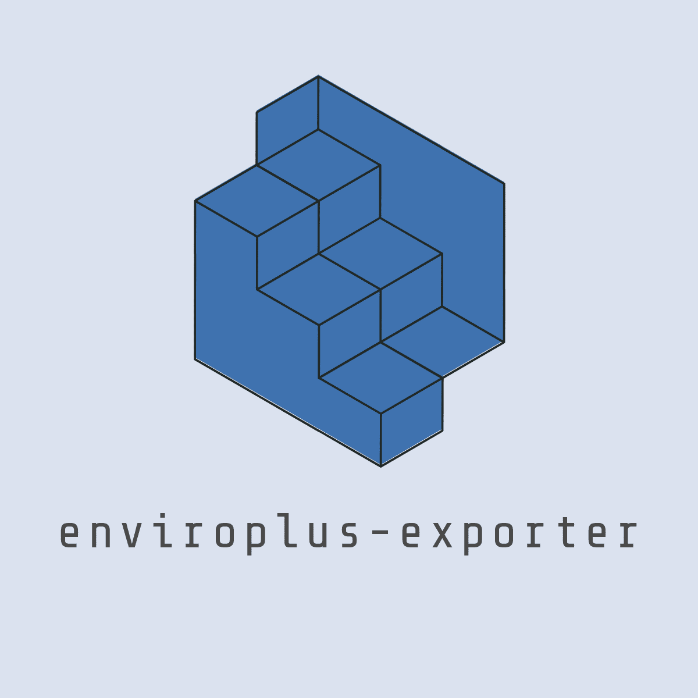
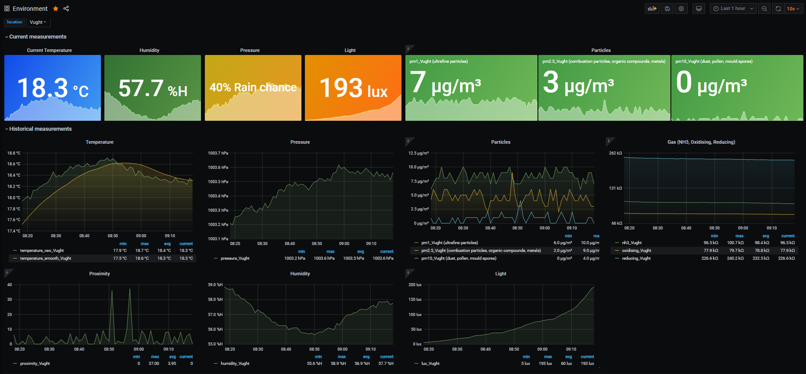
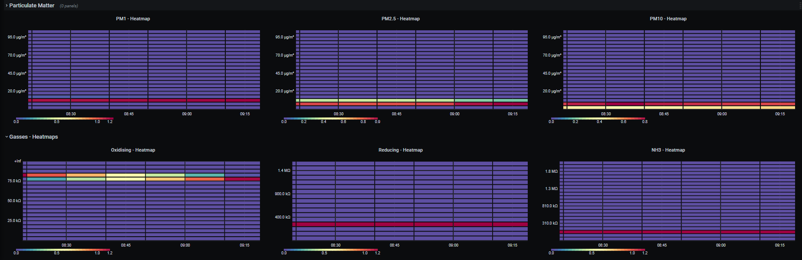

<!--
*** Thanks for checking out this README Template. If you have a suggestion that would
*** make this better, please fork the enviroplus_exporter and create a pull request or simply open
*** an issue with the tag "enhancement".
*** Thanks again! Now go create something AMAZING! :D
***
***
***
*** To avoid retyping too much info. Do a search and replace for the following:
*** tijmenvandenbrink, enviroplus_exporter, tijmenvdbrink, email
-->


<!-- PROJECT SHIELDS -->
<!--
*** I'm using markdown "reference style" links for readability.
*** Reference links are enclosed in brackets [ ] instead of parentheses ( ).
*** See the bottom of this document for the declaration of the reference variables
*** for contributors-url, forks-url, etc. This is an optional, concise syntax you may use.
*** https://www.markdownguide.org/basic-syntax/#reference-style-links
-->
[![Contributors][contributors-shield]][contributors-url]
[![Forks][forks-shield]][forks-url]
[![Stargazers][stars-shield]][stars-url]
[![Issues][issues-shield]][issues-url]
[![MIT License][license-shield]][license-url]


<!-- PROJECT LOGO -->
<br />
<p align="center">
  <a href="https://github.com/tijmenvandenbrink/enviroplus_exporter">
    
  </a>

  <h3 align="center">Enviroplus-exporter</h3>

  <p align="center">
    Prometheus exporter for enviroplus module by Pimoroni
    <br />
    <a href="https://github.com/tijmenvandenbrink/enviroplus_exporter"><strong>Explore the docs »</strong></a>
    <br />
    <br />
    <a href="https://github.com/tijmenvandenbrink/enviroplus_exporter">View Demo</a>
    ·
    <a href="https://github.com/tijmenvandenbrink/enviroplus_exporter/issues">Report Bug</a>
    ·
    <a href="https://github.com/tijmenvandenbrink/enviroplus_exporter/issues">Request Feature</a>
  </p>
</p>


<!-- TABLE OF CONTENTS -->
## Table of Contents

* [About the Project](#about-the-project)
  * [Built With](#built-with)
* [Getting Started](#getting-started)
  * [Prerequisites](#prerequisites)
  * [Installation](#installation)
* [Usage](#usage)
* [Docker](#docker)
* [Roadmap](#roadmap)
* [Contributing](#contributing)
* [License](#license)
* [Contact](#contact)
* [Acknowledgements](#acknowledgements)


<!-- ABOUT THE PROJECT -->
## About The Project

This project was built to export sensor data from Pimoroni's Enviro+ environmental monitoring board for Raspberry Pi. The main goal is to export it in a format so that [Prometheus](https://prometheus.io/) can scrape it so it can then be visualized in a Grafana Dashboard (see installation instruction below), but along the way there were some contributions to the project to also include exporting the data to InfluxDB and [Sensor.Community](https://sensor.community/en/) (formerly known as Luftdaten).

You can run the enviroplus-exporter as a script on your Raspi but I also maintain docker images and a Helm Chart. See the instructions below for your preferred way of installing it.

### Built With

* [Pimoroni/enviroplus-python](https://github.com/pimoroni/enviroplus-python)
* [Prometheus](https://prometheus.io/)
* [Grafana](https://grafana.com/)


<!-- GETTING STARTED -->
## Getting Started

To get the prometheus enviroplus-exporter up and running I'm assuming you already have Prometheus and Grafana running somewhere. 
***Note***: I wouldn't recommend running Prometheus on a Raspberry Pi (using a local SD card) as this could drastically reduce the lifetime of the SD card as samples are written quite often to disk.

### Prerequisites

- Enviro or Enviro+ Environment board from Pimoroni
- Raspberry Pi

### Installation (run as a script)

When running the enviroplus-exporter as a script you need:

- Python3
- enviroplus-python library by Pimoroni

#### One-line (Installs enviroplus-python library from GitHub)

```sh
curl -sSL https://get.pimoroni.com/enviroplus | bash
```

**Note** Raspbian Lite users may first need to install git: `sudo apt install git`

We're going to run the enviroplus-exporter as the user ```pi``` in the directory ```/usr/src/```. Adjust this as you wish.
 
1.Clone the enviroplus-exporter repository
```sh
cd
git clone https://github.com/tijmenvandenbrink/enviroplus_exporter.git
sudo cp -r enviroplus_exporter /usr/src/
sudo chown -R pi:pi /usr/src/enviroplus_exporter
```

2.Install dependencies for enviroplus-exporter
```sh
pip3 install -r requirements.txt
```

3.Install as a Systemd service
```sh
cd /usr/src/enviroplus_exporter
sudo cp contrib/enviroplus-exporter.service /etc/systemd/system/enviroplus-exporter.service
sudo chmod 644 /etc/systemd/system/enviroplus-exporter.service
sudo systemctl daemon-reload
```
4.Enable and start the enviroplus-exporter service
```sh
sudo systemctl enable --now enviroplus-exporter
```
5.Check the status of the service
```sh
sudo systemctl status enviroplus-exporter
```
If the service is running correctly, the output should resemble the following:

```
pi@raspberrypi:/usr/src/enviroplus_exporter $ sudo systemctl status enviroplus-exporter
● enviroplus-exporter.service - Enviroplus-exporter service
   Loaded: loaded (/etc/systemd/system/enviroplus-exporter.service; disabled; vendor preset: enabled)
   Active: active (running) since Fri 2020-01-17 14:13:41 CET; 5s ago
 Main PID: 30373 (python)
    Tasks: 2 (limit: 4915)
   Memory: 6.0M
   CGroup: /system.slice/enviroplus-exporter.service
           └─30373 /usr/bin/python /usr/src/enviroplus_exporter/enviroplus_exporter.py --bind=0.0.0.0 --port=8000

Jan 17 14:13:41 wall-e systemd[1]: Started Enviroplus-exporter service.
Jan 17 14:13:41 wall-e python[30373]: 2020-01-17 14:13:41.565 INFO     enviroplus_exporter.py - Expose readings from the Enviro+ sensor by Pimoroni in Prometheus format
Jan 17 14:13:41 wall-e python[30373]: Press Ctrl+C to exit!
Jan 17 14:13:41 wall-e python[30373]: 2020-01-17 14:13:41.581 INFO     Listening on http://0.0.0.0:8000
```

6.Enable at boot time
```sh
sudo systemctl enable enviroplus-exporter
```

#### Enviro users

If you are using an Enviro (not Enviro+) add `--enviro=true` to the command line (in the `/etc/systemd/system/enviroplus-exporter.service` file) then it won't try to use the missing sensors.

### Run enviroplus-exporter using Docker

1. Use the published image

```sh
docker pull ghcr.io/tijmenvandenbrink/enviroplus_exporter:latest
```

The following image tags are published:

- `latest` which is the latest stable version. It's best practice not to use latest so you can use the specific version (SemVer is used) that comes along with it. E.g. `1.1.0` or `1.1`.
- `dev` and `nightly` which is used for development. You probably don't want to use this one as it's not guaranteed to run.

For more information look at the Packages overview [here](https://github.com/tijmenvandenbrink/enviroplus_exporter/pkgs/container/enviroplus_exporter).

2. Or build it yourself

```sh
docker build -t enviroplus-exporter .
```

Or using [BuildKit](https://docs.docker.com/develop/develop-images/build_enhancements/) you can build Raspberry Pi compatible images on an amd64.

```sh
docker buildx build --platform linux/arm/v7,linux/arm64/v8 .
```

3. Running

```sh
docker run -d enviroplus-exporter -d -p 8000:8000 --device=/dev/i2c-1 --device=/dev/gpiomem --device=/dev/ttyAMA0 enviroplus-exporter
```

### Run using the Helm Chart

To use the Helm Chart for installing the enviroplus-exporter in a Kubernetes cluster you'll need [Helm 3](https://v3.helm.sh/) and a Kubernetes Cluster. I personally use [K3s](https://k3s.io/) bootstrapped with [k3s-up](https://github.com/alexellis/k3sup).

#### Initialize a Helm Chart Repository
Once you have Helm ready, you can add the chart repository.

```sh
helm repo add enviroplus-exporter https://tijmenvandenbrink.github.io/enviroplus_exporter/
```

Once this is installed, you will be able to list the charts you can install:

```sh
helm search repo enviroplus-exporter
```

To install the chart, you can run the helm install command.

```sh
helm install enviroplus-exporter enviroplus-exporter/enviroplus-exporter
```

If you want to override any defaults specified in `values.yaml` you can provide your own values with the `-f` argument:

```sh
helm install -f enviroplus-values.yaml enviroplus-exporter enviroplus-exporter/enviroplus-exporter
```

Have a look at `charts/enviroplus-exporter/values.yaml` for more information.

<!-- USAGE EXAMPLES -->
## Usage

So now we've setup the Prometheus enviroplus-exporter we can start scraping this endpoint from our Prometheus server and get a nice dashboard using Grafana.  

### Prometheus

If you haven't setup Prometheus yet have a look at the installation guide [here](https://prometheus.io/docs/prometheus/latest/installation/).

Below is a simple scraping config:

```yaml
# Sample config for Prometheus.

global:
  scrape_interval:     15s # By default, scrape targets every 15 seconds.
  evaluation_interval: 15s # By default, scrape targets every 15 seconds.
  # scrape_timeout is set to the global default (10s).

  # Attach these labels to any time series or alerts when communicating with
  # external systems (federation, remote storage, Alertmanager).
  external_labels:
      monitor: 'external'

# Load and evaluate rules in this file every 'evaluation_interval' seconds.
rule_files:
  # - "first.rules"
  # - "second.rules"

# A scrape configuration containing exactly one endpoint to scrape:
# Here it's Prometheus itself.
scrape_configs:
  # The job name is added as a label `job=<job_name>` to any timeseries scraped from this config.
  - job_name: 'prometheus'

    # Override the global default and scrape targets from this job every 5 seconds.
    scrape_interval: 15s
    scrape_timeout: 15s

    # metrics_path defaults to '/metrics'
    # scheme defaults to 'http'.

    static_configs:
    - targets: ['localhost:9090']

  - job_name: node
    # If prometheus-node-exporter is installed, grab stats about the local
    # machine by default.
    static_configs:
    - targets: ['localhost:9100']

    # If environmentplus-exporter is installed, grab stats about the local
    # machine by default.
  - job_name: environment
    static_configs:
    - targets: ['localhost:8000']
      labels:
        group: 'environment'
        location: 'Amsterdam'
        
    - targets: ['newyork.example.com:8001']
      labels:
        group: 'environment'
        location: 'New York'
``` 

I added two labels to the targets ```group: environment``` and ```location: SomeLocation```. The Grafana dashboard uses these labels to distinguish the various locations.

### Grafana

I published the dashboard on [grafana.com](https://grafana.com/grafana/dashboards/11605). You can import this dashboard using the the ID 11605. Instructions for importing the dashboard can be found [here](https://grafana.com/docs/grafana/latest/reference/export_import/).

<p align="center">
  <a href="images/grafana_dashboard_1.png">
    
  </a>
  <a href="images/grafana_dashboard_2.png">
    
  </a>
</p>

<!-- ROADMAP -->
## Roadmap

See the [open issues](https://github.com/tijmenvandenbrink/enviroplus_exporter/issues) for a list of proposed features (and known issues).


<!-- CONTRIBUTING -->
## Contributing

Contributions are what make the open source community such an amazing place to be learn, inspire, and create. Any contributions you make are **greatly appreciated**.

1. Fork the Project
2. Create your Feature Branch (`git checkout -b feature/AmazingFeature`)
3. Commit your Changes (`git commit -m 'Add some AmazingFeature'`)
4. Push to the Branch (`git push origin feature/AmazingFeature`)
5. Open a Pull Request


<!-- LICENSE -->
## License

Distributed under the MIT License. See `LICENSE` for more information.


<!-- ACKNOWLEDGEMENTS -->
## Acknowledgements


<!-- MARKDOWN LINKS & IMAGES -->
<!-- https://www.markdownguide.org/basic-syntax/#reference-style-links -->
[contributors-shield]: https://img.shields.io/github/contributors/tijmenvandenbrink/enviroplus-exporter
[contributors-url]: https://github.com/tijmenvandenbrink/enviroplus_exporter/graphs/contributors
[forks-shield]: https://img.shields.io/github/forks/tijmenvandenbrink/enviroplus-exporter?label=Fork
[forks-url]: https://github.com/tijmenvandenbrink/enviroplus_exporter/network/members
[stars-shield]: https://img.shields.io/github/stars/tijmenvandenbrink/enviroplus-exporter
[stars-url]: https://github.com/tijmenvandenbrink/enviroplus_exporter/stargazers
[issues-shield]: https://img.shields.io/github/issues-raw/tijmenvandenbrink/enviroplus-exporter
[issues-url]: https://github.com/tijmenvandenbrink/enviroplus_exporter/issues
[license-shield]: https://img.shields.io/github/license/tijmenvandenbrink/enviroplus-exporter
[license-url]: https://github.com/tijmenvandenbrink/enviroplus_exporter/blob/master/LICENSE
[linkedin-shield]: https://img.shields.io/badge/-LinkedIn-black.svg&logo=linkedin&colorB=555
[linkedin-url]: https://linkedin.com/in/tijmenvandenbrink
[product-screenshot]: images/screenshot.png
